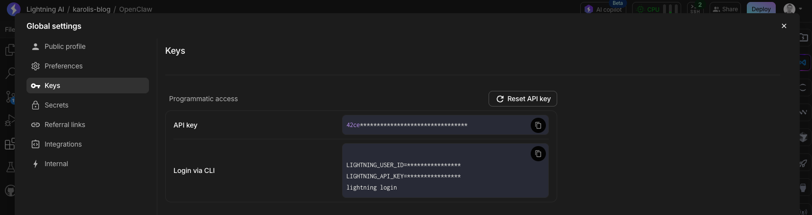
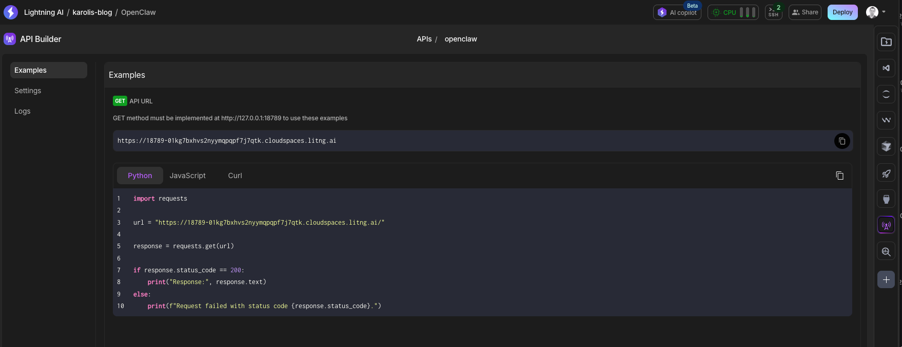

# Lightning AI OpenClaw environment

- Gateway starts on boot through .lightning_studio/on_start.sh

## Getting started

This template launches OpenClaw on start. You will just need to get your personal API key and find the studio URL:

1. **Getting your API key**

    Navigate to global settings (top right -> keys):

    

2. **Get studio URL**

    Click on the "API builder" in the right side menu, then click "openclaw" and you will find your URL there. It should look like `https://18789-xxxx.cloudspaces.litng.ai`

    

Now append your token to the public URL and copy it into the browser, like:

```
https://18789-YOUR_SUBDOMAIN.cloudspaces.litng.ai?token=YOUR_API_KEY
```

## OpenClaw documentation & configuration

- Configuration examples: https://docs.openclaw.ai/gateway/configuration-examples

## Data

Session transcripts are stored as JSONL at:

* `~/.openclaw/agents/<agentId>/sessions/<SessionId>.jsonl`

Configuration lives at:

* `~/.openclaw/openclaw.json`

## Credits

By default this environment is preconfigured with your personal LIGHTNING_API_KEY. It will consume credits during conversations and you can top up at any point in time.

## Accessing OpenClaw web UI

1. Click on the API builder on the right side and add port 18789. 
2. Leave authentication off, OpenClaw handles authentication on its own
3. Open the URL and append `?token=change-me-now`, this will authenticate your session

## Providers and Models

We have already preconfigured Lightning AI models to be used as a provider, it will work out of the box. 
To try out different models, go to our [models page](https://lightning.ai/lightning-ai/models?section=allmodels) and specify new ones with a prefix `custom-proxy`, for example:

```json
 "agents": {
    "defaults": {
      "model": {
        "primary": "custom-proxy/openai/gpt-5.2-2025-12-11"
      },
      "workspace": "/teamspace/studios/this_studio/.openclaw/workspace",
      "compaction": {
        "mode": "safeguard"
      },
      "heartbeat": {
        "model": "custom-proxy/openai/gpt-5.2-2025-12-11"
      },
      "maxConcurrent": 4,
      "subagents": {
        "maxConcurrent": 8
      }
    }
  },
```

## Next steps

Go ahead and install addons

